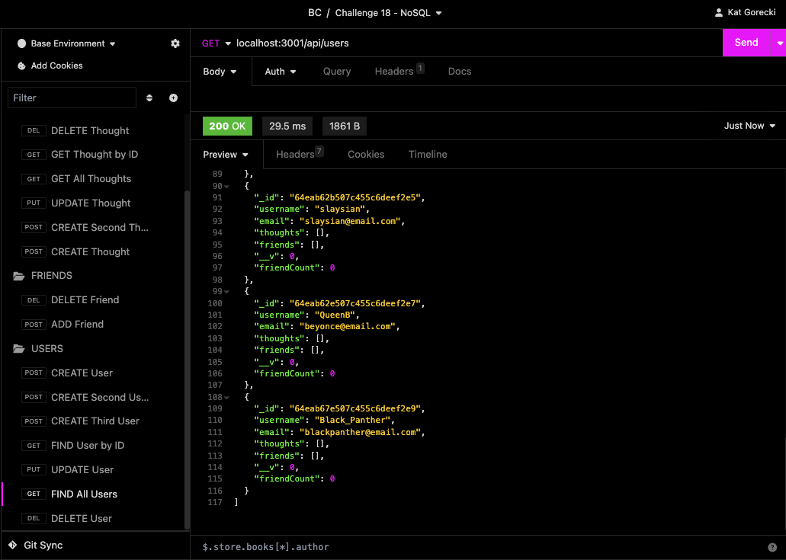
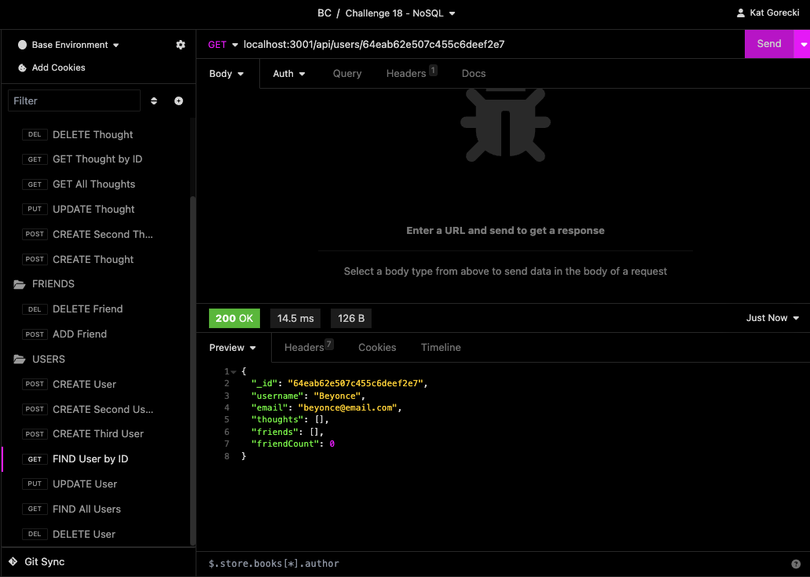
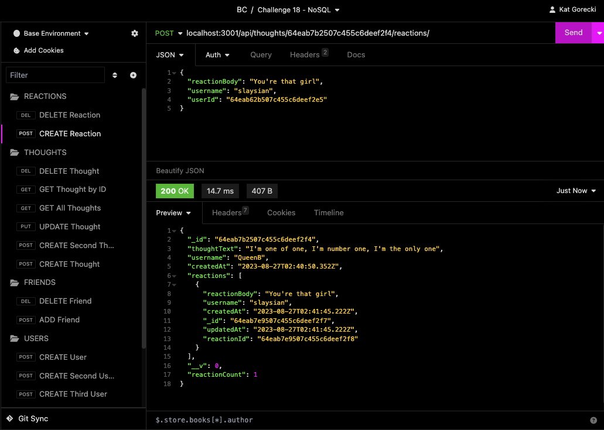
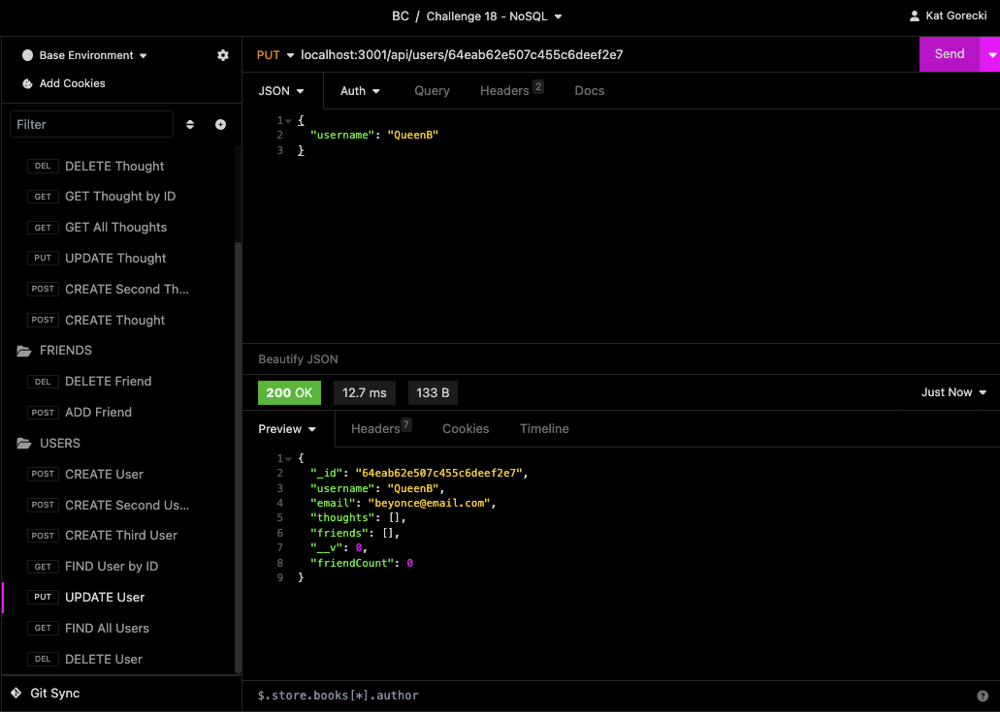
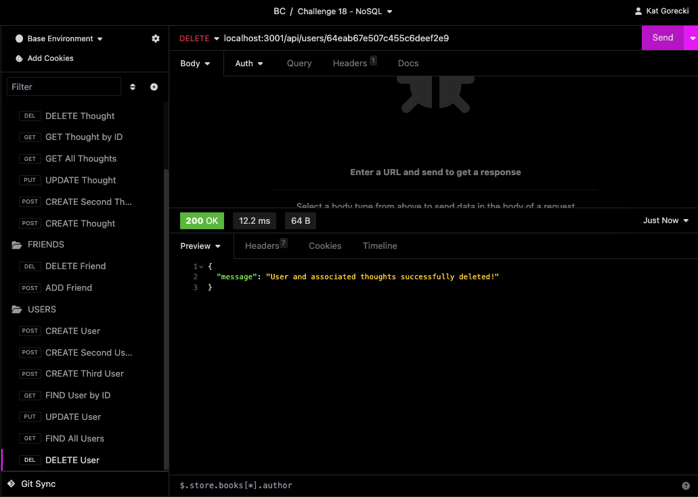

# Social Network API

> ## DESCRIPTION
  For a social media startup, a way to manage your users and posts. You can:
  - View all users, view user by ID, create a user, update user by ID, delete user by ID, add a friend to user, and remove a friend from a user.
  - Create new thoughts, assigning to user and see when it was created
  - Update a thought, delete a thought, view all thoughts and view a single thought.
  - Add or remove a reaction from a thought.

## TABLE OF CONTENTS
  1. [Description](#description)
  2. [Usage](#usage)
  3. [References](#references)
  4. [License](#license)
  5. [Contributing](#contributing)
  6. [Questions](#questions)

> ## USAGE

https://github.com/SLAYsian/mongoose-knuckle/assets/127693250/f42ae747-966f-4853-8a98-22cbd5832d67

#### Install all npm packages 
#### Start the server by entering `npm start` in your command line  
#### Using Insomnia, send GET routes at `localhost:3001/api/users` to VIEW ALL USERS, `localhost:3001/api/thoughts` to VIEW ALL THOUGHTS  
 
#### To view a specific user or thought, add /`id` of the specific item you'd like to view at the end of the URL of the GET route. Example: `localhost:3001/api/user/64eab0008c1a2a48c17eb732`  

#### Create POST route to CREATE a thought, user, reaction, or friend. sending the data in JSON format.  
  
#### Create PUT route to UPDATE a user or thought, adding the desired /`id` at the end of the url request. Example: `localhost:3001/api/products/64eab0008c1a2a48c17eb732` Sending the updated data in JSON format.    

#### Create DELETE route to REMOVE a friend, user, thought, or reaction.    

> ## REFERENCES
- UDEMY Jonas Schmedtmann courses (https://codingheroes.io/resources/)
- UDEMY Dr Angela Yu (https://appbrewery.com/)
- W3Schools (https://www.w3schools.com/)
- UConn Coding Bootcamp - Module 18 NoSQL Lessons

> ## LICENSE
 
Please see the LICENSE file for details

> ## CONTRIBUTING
#### If you are interested in contributing to this project, please follow these steps:
- Fork the repo on GitHub
- Clone the project to your own machine
- Commit changes to your own branch
- Push your work back up to your fork
- Submit a pull request for review

> ## QUESTIONS
For any questions, please reach out to me via GitHub (https://github.com/SLAYsian).
